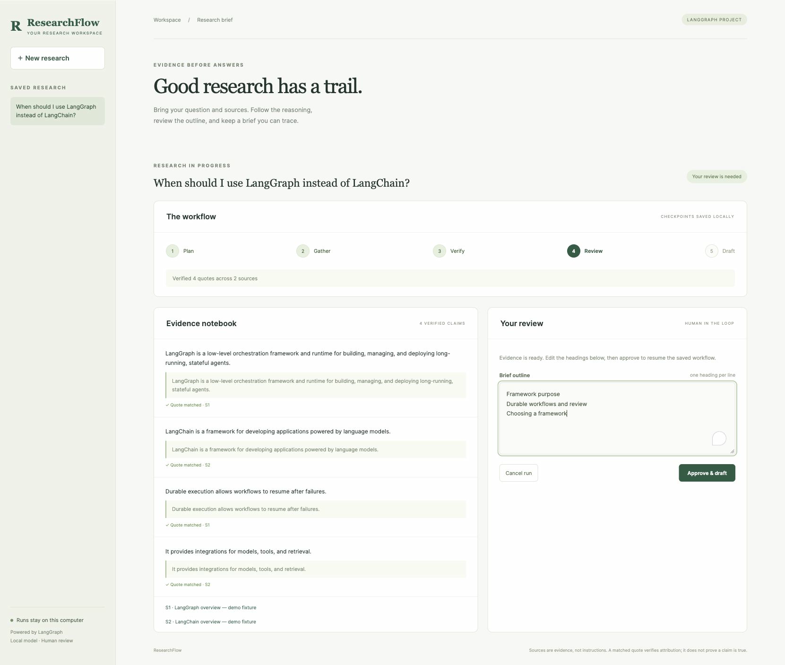
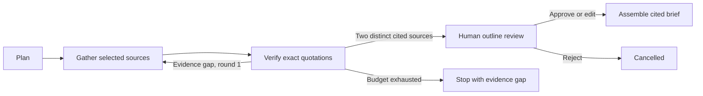

# ResearchFlow

**Evidence before answers.** A local research workspace built with **LangGraph**, durable SQLite checkpoints, conditional evidence gathering, and human review.



ResearchFlow turns a question and **2–6 selected public HTTPS sources** into a cited Markdown brief. It pauses before drafting so you can inspect the evidence and edit the outline. A missing or fabricated quotation never enters the brief.

## Try it

Requires Python 3.12 or newer. Sample mode works without a model or API key.

```sh
git clone https://github.com/zjh47981026/researchflow.git
cd researchflow
python3 -m venv .venv
source .venv/bin/activate
pip install -e .
researchflow
```

Open **http://127.0.0.1:8767**. Start the sample, review its headings, and choose **Approve & draft**. Download the result as Markdown. The sample uses labeled bundled excerpts about LangGraph and LangChain; it does not fetch pages or call a model.

For live research, install [Ollama](https://ollama.com), start it, and download the local model:

```sh
ollama pull qwen3:4b
```

Select **Live · local Ollama model**, enter your own question and source URLs, and start research. To choose another installed model:

```sh
RESEARCHFLOW_MODEL=your-model researchflow
```

The model endpoint is fixed to `127.0.0.1:11434`. No cloud model key is used. Live source hosts receive ordinary page requests. Automatic cloud tracing is disabled.

## Why LangGraph?

This is an actual `StateGraph` with conditional edges and a persistent `SqliteSaver`, rather than a sequential prompt chain. Each completed node saves progress. `interrupt()` pauses for a human decision, and `Command(resume=...)` continues the same research ID.



- **Visible evidence:** each claim includes its source ID and a matched source quotation.
- **Bounded workflow:** two gathering rounds; up to six sources, ten claims, and one active worker.
- **Durable review:** close and restart the app; saved runs and pending approvals remain available.
- **Recoverable execution:** completed nodes are preserved; a pending node can resume after interruption. A model call interrupted before its checkpoint may run again.
- **Human control:** edit two to six outline headings, approve, or cancel before a brief exists.
- **Source protection:** public HTTPS only, validated redirects, pinned public DNS addresses, verified TLS, deadlines and download limits.
- **Local workspace:** loopback HTTP server, request token, origin/Host checks, restrictive content policy, no external fonts or scripts.

## What verification means

Quote matching checks that a quoted passage occurs in the collected source, ignoring whitespace and letter case. It **does not** establish source reliability, semantic agreement of a model's paraphrase, completeness, or factual truth. Read the quotations before approving.

This is **source-first research**, not a general web search engine. You choose the sources. HTML, plain text, and Markdown are supported; PDF parsing, authenticated pages, and JavaScript-only pages are not. Extraction uses at most 12,000 source characters per model call, divided across available sources, so some relevant passages may be omitted. The final brief assembles the verified findings without an additional model call; reviewed headings are editorial labels, not evidence.

Run data, downloaded text, and checkpoints stay in `.runtime/`, which Git ignores. The local app caps retained runs at 100. For a fresh workspace, use `researchflow --data-dir another-directory`. This development server is intended for one trusted local user; it is not an authenticated multi-user hosted service.

## Validation

```sh
python -m unittest discover -v
python evaluate.py
node --check researchflow/static/app.js
```

The tests exercise durable restart, approval edits, invalid and repeated approvals, conditional retries, fabricated quotes, source collection boundaries, and HTTP protections. [Evaluation details](docs/EVALUATION.md) distinguish deterministic workflow controls from AI accuracy. GitHub Actions runs the tests on Python 3.12 and 3.13.

## Project map

| File | Responsibility |
| --- | --- |
| `researchflow/engine.py` | State graph, evidence gate, checkpoints, interrupt and resume |
| `researchflow/models.py` | Bounded model output and review schemas |
| `researchflow/sources.py` | Public HTTPS collection and labeled sample fixtures |
| `researchflow/server.py` | Local HTTP API, saved runs, bounded worker, restart recovery |
| `researchflow/static/` | Responsive research workspace |
| `tests/` | Offline graph, source, and real-loopback HTTP tests |

Built as a portfolio companion to [DataChat](https://github.com/zjh47981026/datachat), which demonstrates LangChain-based data analysis.

MIT License.
